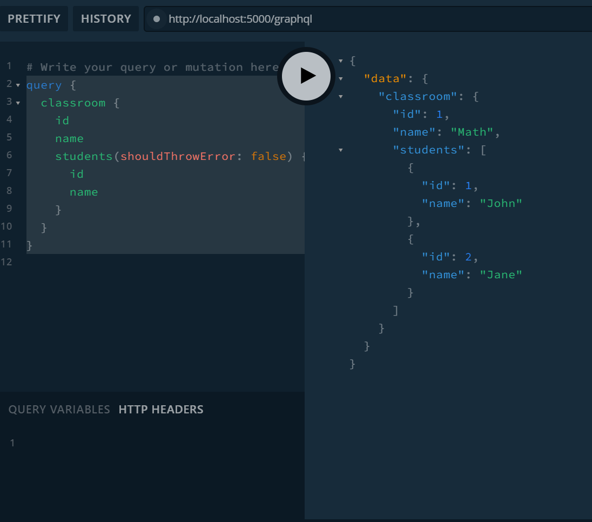
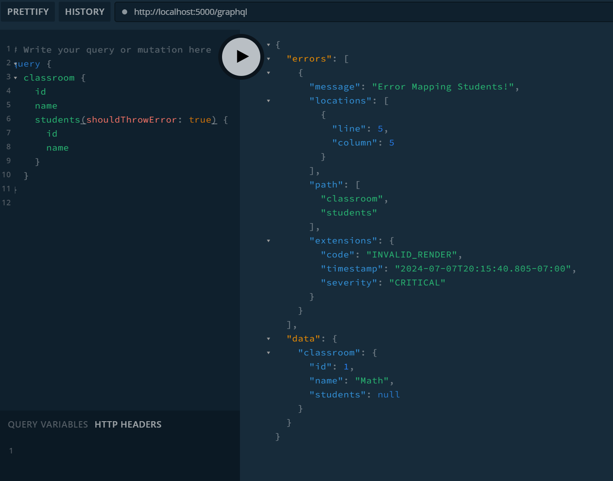

# Handling Exceptions thrown from POCOs


There are times where you may wish to implement a method or property based field on a regular POCO. Doing so negates the ability to use any `IGraphActionResult` methods (e.g. `this.Error()`, `this.NotFound()`). If an exception is thrown in this method-based graph field there is no traditional way to directly handle this exception and return a "nice error" to the caller. By default, the library will only render an unhandled exception message and require you to expose exceptions to see the details, potentially leaking sensitive details.

One way around this short coming is to use a piece of a custom middleware to process the exception before the field completes its rendering cycle.  Its important to know that an unhandled exceptions in your code are captured as messages on the field context.

This Demo: 
* Demonstrates throwing a custom exception (`PublicMessageException`) from a method-based field (`Classroom.Students`)
* Implements a piece of middleware that executes on every field
* This middleware inspects captured messages for the thrown exception
* When found, the exception is mapped to the message property. The `Message` property is always returned to the user as a standard error. It is intended to be public, caller facing content.
* The exception is removed from the message

Sample Query
```graphql
query {
  classroom {
    id
    name
    students(shouldThrowError: true) {
      id
      name
    }
  }
}
```

### Successful Output:


### Failed Output:
_Note that no exception is indicated on the error_

